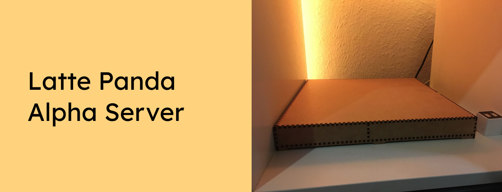

Use your Latte Panda Alpha and some HDDs to build your own server!

Want to support the development and stay updated?

 

## Instrutions

Use the .plf files or load the .svg files from /Part 1 and /Part 2 into your lasercutter software and cut them on 3mm thick MDF plates.
Then connect them like in the 3D model here: [https://www.tinkercad.com/things/iQrbcces0ZO](https://www.tinkercad.com/things/iQrbcces0ZO)
Once you are done, place your Latte Panda Alpha in the top right compartment (fan down, to get the best airflow) and your 2.5" HDDs/SSDs in the other compartments. Like in this photo:
